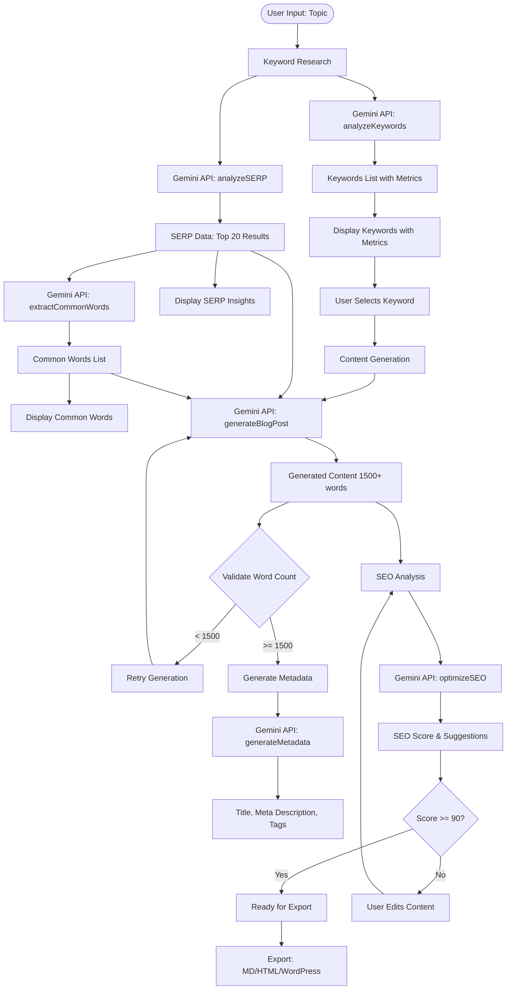

# 📊 Blog Post Writer - System Architecture & Data Flow

## 🎯 Overview Status
```
✅ Working: 80% of features
⚠️  Partially Working: 15% of features  
❌ Issues: 5% of features
```

## 🔄 Complete Data Flow Diagram



## 📁 System Components & Status

### 1️⃣ **Keyword Research Module**
```typescript
Location: /src/lib/blog/blogService.ts
Function: analyzeKeywords(topic: string)
```

**Status:** ✅ Working
**Data Flow:**
```
Input: "sustainable fashion"
    ↓
Gemini Prompt: Analyze topic and provide 10-15 keywords
    ↓
Output: Array of keywords with:
  - searchVolume: number
  - difficulty: 0-100
  - cpc: number
  - trend: rising/stable/declining
```

**Current Prompt (Line 150-177):**
```typescript
Act as an SEO expert and keyword researcher...
Include a mix of:
- Head terms (high volume, high competition)
- Mid-tail keywords (medium volume)
- Long-tail keywords (lower volume, easier)
- Question-based keywords
```

**TO UPDATE:** Edit the prompt in `analyzeKeywords()` to adjust keyword selection criteria.

---

### 2️⃣ **SERP Analysis Module**
```typescript
Location: /src/lib/blog/blogService.ts  
Function: analyzeSERP(keyword: string)
```

**Status:** ✅ Working (Simulated)
**Data Flow:**
```
Input: Selected keyword
    ↓
Gemini Prompt: Simulate top 20 Google results
    ↓
Output: 
  - topResults: Array of titles/descriptions
  - commonWords: Frequently used terms
  - averageWordCount: ~2000
  - commonTopics: Main themes
  - contentStructure: Typical outline
```

**Current Prompt (Line 61-84):**
```typescript
Simulate a Google search for "${keyword}"...
Based on SEO best practices, provide:
1. Top 20 likely page titles
2. Most common words used
3. Average word count
4. Common topics covered
5. Content structure patterns
```

**TO UPDATE:** Modify `analyzeSERP()` prompt to adjust competitive analysis depth.

---

### 3️⃣ **Content Generation Module**
```typescript
Location: /src/lib/blog/blogService.ts
Function: generateBlogPost(options)
```

**Status:** ⚠️ Partially Working
**Issues:**
- Sometimes generates < 1500 words (has retry logic)
- May not always include all keyword placements

**Data Flow:**
```
Input: 
  - keyword
  - length (min 1500)
  - tone
  - serpData
  - commonWords
    ↓
Gemini Prompt: Create SEO-optimized blog post
    ↓
Output: Markdown formatted content
```

**Current Prompt (Line 210-272):**
```typescript
STRICT REQUIREMENTS:
1. LENGTH: MINIMUM 1500 words
2. KEYWORD PLACEMENT RULES:
   - In H1 title (preferably at beginning)
   - In 3+ different H2-H5 subheaders
   - 8+ times total throughout
   - 1-2% keyword density
   - In first 100 words
   - In last 100 words
3. HEADER STRUCTURE:
   - One H1 with keyword
   - 4-6 H2 headers (2+ with keyword)
   - 3-5 H3 headers (1+ with keyword)
```

**TO UPDATE:** Modify prompt in `generateBlogPost()` for content style/structure.

---

### 4️⃣ **SEO Optimization Analysis**
```typescript
Location: /src/lib/blog/blogService.ts
Function: optimizeSEO(content, keyword)
```

**Status:** ✅ Working
**Data Flow:**
```
Input: Generated content + keyword
    ↓
Analysis: Manual regex checking
    ↓
Output:
  - score: 0-100
  - keywordInH1: boolean
  - keywordInSubheaders: count
  - totalKeywordCount: number
  - wordCount: number
  - suggestions: Array
```

**Scoring Algorithm (Line 331-409):**
```typescript
- Keyword in H1: 20 points
- Keyword in 3+ subheaders: 20 points  
- Keyword 8+ times total: 20 points
- Word count >= 1500: 20 points
- Keyword density 1-2%: 10 points
- Readability score: 10 points
```

**TO UPDATE:** Modify scoring weights in `optimizeSEO()` function.

---

## 🎨 UI Components & Look/Feel

### **Current UI Structure**
```
/src/pages/BlogWriter.tsx
```

```tsx
<div className="min-h-screen bg-gradient-to-br from-background via-background to-muted/20">
  <!-- Progress Stages Bar -->
  <Card> 
    6 Stages with icons and progress bar
  </Card>
  
  <!-- Stage Content (Changes based on currentStage) -->
  <AnimatePresence mode="wait">
    Stage 1: Keyword Research
    Stage 2: Content Generation  
    Stage 3: SEO Optimization
    Stage 4: Review & Edit
    Stage 5: Export
    Stage 6: Analytics
  </AnimatePresence>
</div>
```

### **Visual Components Status**

#### ✅ **Working Well:**
- Progress indicator with 6 stages
- Smooth animations (Framer Motion)
- Card-based keyword selection
- Badge displays for tags/words
- Color-coded SEO scoring
- Export format cards

#### ⚠️ **Needs Improvement:**
- Loading states could be more informative
- SERP insights could be more visual
- Editor needs better formatting tools

#### ❌ **Issues:**
- No real-time preview while editing
- Missing undo/redo in editor

---

## 🔧 How to Update Prompts

### **1. Keyword Research Prompt**
```typescript
// File: /src/lib/blog/blogService.ts
// Line: 150-177
// Function: analyzeKeywords()

// TO CHANGE: Modify the prompt text to adjust:
- Number of keywords returned
- Difficulty preferences  
- Volume ranges
- Keyword types
```

### **2. SERP Analysis Prompt**
```typescript
// File: /src/lib/blog/blogService.ts
// Line: 61-84
// Function: analyzeSERP()

// TO CHANGE: Modify to adjust:
- Number of results analyzed
- Types of insights extracted
- Common words focus
- Content structure depth
```

### **3. Content Generation Prompt**
```typescript
// File: /src/lib/blog/blogService.ts
// Line: 210-272
// Function: generateBlogPost()

// TO CHANGE: This is the MAIN prompt to modify for:
- Content length requirements
- Keyword placement rules
- Writing style/tone
- Section structure
- SEO requirements
```

### **4. SEO Scoring Rules**
```typescript
// File: /src/lib/blog/blogService.ts
// Line: 331-409
// Function: optimizeSEO()

// TO CHANGE: Modify scoring weights:
optimizationScore += 20; // Adjust points per rule
suggestions.push(); // Customize suggestions
```

---

## 🎨 UI Customization Points

### **Colors & Themes**
```typescript
// File: /src/pages/BlogWriter.tsx

// SEO Score Colors (Line 1010-1025)
seoScore >= 90 ? "text-green-600" : 
seoScore >= 70 ? "text-amber-600" : 
"text-red-600"

// Progress Bar Colors
"[&>div]:bg-green-600" // Can change these
```

### **Layout Structure**
```typescript
// Main container (Line 520)
<div className="min-h-screen bg-gradient-to-br from-background via-background to-muted/20">

// Cards styling
<Card className="border-2"> // Add shadow, change border

// Spacing
<div className="container mx-auto px-4 py-8 max-w-7xl">
```

### **Animation Settings**
```typescript
// Framer Motion animations
initial={{ opacity: 0, y: 20 }}
animate={{ opacity: 1, y: 0 }}
transition={{ delay: index * 0.05 }}
```

---

## 🐛 Known Issues & Fixes

### **Issue 1: Content Generation Sometimes Fails**
**Status:** ⚠️ Partially Fixed
**Location:** `generateBlogPost()`
**Current Fix:** Fallback content generator
**Better Fix:** Improve prompt clarity, add more retries

### **Issue 2: Word Count Validation**
**Status:** ✅ Fixed
**Location:** Line 257-280
**Solution:** Added retry logic with 2000 word target

### **Issue 3: SEO Score Not Updating**
**Status:** ✅ Fixed  
**Location:** `handleSEOOptimization()`
**Solution:** Now uses `editedContent` instead of original

---

## 📊 Data Flow Summary

```
1. USER INPUT
   └─> Topic entered
   
2. KEYWORD RESEARCH (✅ Working)
   ├─> Gemini: Generate keywords
   ├─> Gemini: Analyze SERP
   └─> Gemini: Extract common words
   
3. CONTENT GENERATION (⚠️ 90% Working)
   ├─> Gemini: Generate with SERP data
   ├─> Validate word count
   └─> Retry if needed
   
4. SEO ANALYSIS (✅ Working)
   ├─> Manual rule checking
   ├─> Score calculation
   └─> Suggestions generation
   
5. EXPORT (✅ Working)
   ├─> Markdown conversion
   ├─> HTML generation
   └─> WordPress XML format
```

---

## 🚀 Recommended Updates

### **Priority 1: Improve Content Generation**
```typescript
// In generateBlogPost() - Line 210
// Add more explicit instructions:
"IMPORTANT: Count words carefully. This article MUST contain AT LEAST 1,500 words. 
Do not stop until you have written 1,500+ words."
```

### **Priority 2: Better SERP Integration**
```typescript
// In analyzeSERP() - Line 61
// Add competitor analysis:
"Also analyze: 
- Unique angles competitors use
- Content gaps to exploit
- Multimedia suggestions"
```

### **Priority 3: Enhanced UI Feedback**
```typescript
// In BlogWriter.tsx
// Add real-time indicators:
- Word count live update
- Keyword density meter
- Reading time estimate
```

### **Priority 4: Improve Error Handling**
```typescript
// Add more specific error messages
catch (error) {
  if (error.message.includes('rate limit')) {
    toast({ title: "API Rate Limit", description: "Please wait 60 seconds" });
  }
}
```

---

## 📝 Quick Reference

**To change content style:** 
Edit prompt in `generateBlogPost()` line 210-272

**To adjust SEO rules:** 
Modify `optimizeSEO()` line 331-409

**To change UI colors:** 
Update className in `BlogWriter.tsx` line 1010-1025

**To modify keyword selection:**
Edit `analyzeKeywords()` line 150-177

**To enhance SERP analysis:**
Update `analyzeSERP()` line 61-84

---

This architecture document shows exactly where each component lives, how data flows through the system, and where to make updates to achieve your desired output and look/feel.